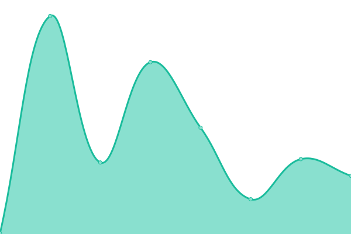
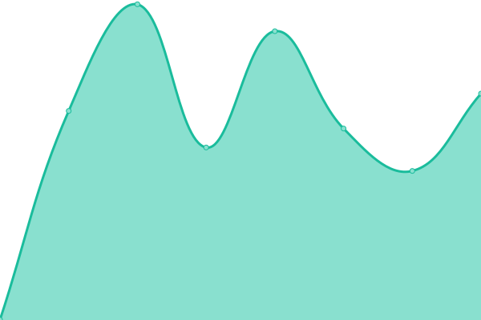
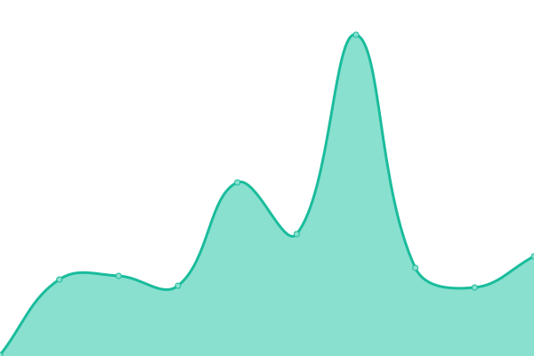

# [📈 Live Status](https://ivuorinen.net): <!--live status--> **🟩 All systems operational**

This repository contains the open-source uptime monitor and status page for [Ismo Vuorinen](https://ivuorinen.net/), powered by [Upptime](https://github.com/upptime/upptime).

With [Upptime](https://upptime.js.org), you can get your own unlimited and free uptime monitor and status page, powered entirely by a GitHub repository. We use [Issues](https://github.com/ivuorinen/uptime/issues) as incident reports, [Actions](https://github.com/ivuorinen/uptime/actions) as uptime monitors, and [Pages](https://ivuorinen.net) for the status page.

<!--start: status pages-->
<!-- This summary is generated by Upptime (https://github.com/upptime/upptime) -->
<!-- Do not edit this manually, your changes will be overwritten -->
<!-- prettier-ignore -->
| URL | Status | History | Response Time | Uptime |
| --- | ------ | ------- | ------------- | ------ |
|  [ivuorinen.net](https://ivuorinen.net) | 🟩 Up | [ivuorinen-net.yml](https://github.com/ivuorinen/uptime/commits/HEAD/history/ivuorinen-net.yml) | 

 109ms
     
 | 

<a href="https://ivuorinen.github.io/uptime/history/ivuorinen-net">100.00%</a>
    

|  [ivuorinen.com](https://ivuorinen.com) | 🟩 Up | [ivuorinen-com.yml](https://github.com/ivuorinen/uptime/commits/HEAD/history/ivuorinen-com.yml) | 

 506ms
     
 | 

<a href="https://ivuorinen.github.io/uptime/history/ivuorinen-com">100.00%</a>
    

|  [antiprocess.net](https://antiprocess.net) | 🟩 Up | [antiprocess-net.yml](https://github.com/ivuorinen/uptime/commits/HEAD/history/antiprocess-net.yml) | 

 502ms
     
 | 

<a href="https://ivuorinen.github.io/uptime/history/antiprocess-net">0.00%</a>
    

|  [demons: paimon](https://paimon.antiprocess.net) | 🟩 Up | [demons-paimon.yml](https://github.com/ivuorinen/uptime/commits/HEAD/history/demons-paimon.yml) | 

 427ms
     
 | 

<a href="https://ivuorinen.github.io/uptime/history/demons-paimon">99.94%</a>
    

|  [demons: baal](https://baal.antiprocess.net) | 🟩 Up | [demons-baal.yml](https://github.com/ivuorinen/uptime/commits/HEAD/history/demons-baal.yml) | 

 453ms
     
 | 

<a href="https://ivuorinen.github.io/uptime/history/demons-baal">99.95%</a>
    

|  [masf.fi](https://masf.fi) | 🟩 Up | [masf-fi.yml](https://github.com/ivuorinen/uptime/commits/HEAD/history/masf-fi.yml) | 

 505ms
     
 | 

<a href="https://ivuorinen.github.io/uptime/history/masf-fi">100.00%</a>
    

|  [escobar.digital](https://escobar.digital) | 🟩 Up | [escobar-digital.yml](https://github.com/ivuorinen/uptime/commits/HEAD/history/escobar-digital.yml) | 

 628ms
     
 | 

<a href="https://ivuorinen.github.io/uptime/history/escobar-digital">100.00%</a>
    

|  [Google](https://www.google.com) | 🟩 Up | [google.yml](https://github.com/ivuorinen/uptime/commits/HEAD/history/google.yml) | 

 93ms
     
 | 

<a href="https://ivuorinen.github.io/uptime/history/google">100.00%</a>
    

<!--end: status pages-->

[**Visit our status website →**](https://ivuorinen.net)

## 📄 License

- Powered by: [Upptime](https://github.com/upptime/upptime)
- Code: [MIT](./LICENSE) © [Anand Chowdhary](https://anandchowdhary.com), supported by [Pabio](https://pabio.com)
- Data in the `./history` directory: [Open Database License](https://opendatacommons.org/licenses/odbl/1-0/)
